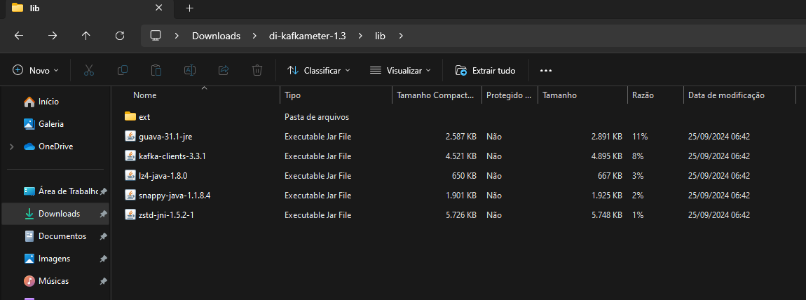
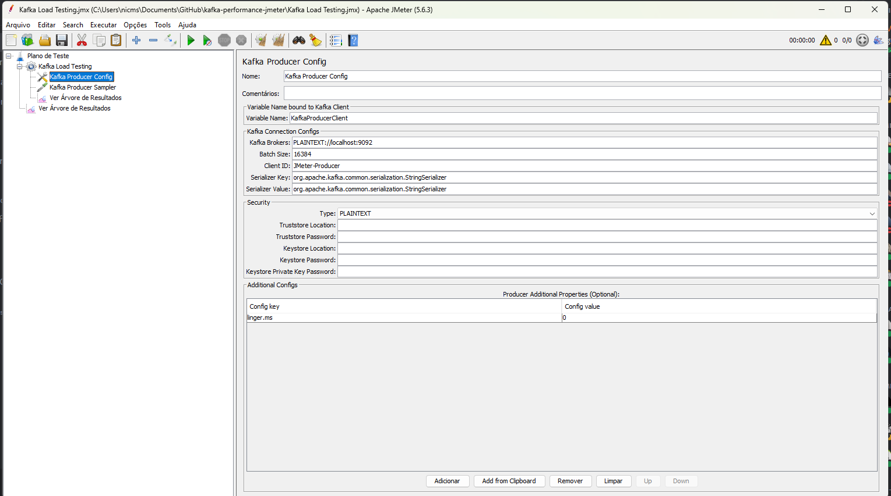

##  Testes Perfomance JMeter e Kafka

### Download Plugin KafkaMeter
#### https://jmeter-plugins.org/ 
#### Procurar por KafkaMeter, selecionar opção DI-KafkaMeter


### Instalar plugin no diretório do JMeter


### Utilizar componentes do Kafka (Consumer e Producer)



## Comandos execução Local

### Subir docker
````sh
docker-compose up
````

### Listar containers
````sh 
docker ps -a
````

### Criar tópico

````sh
docker exec -it <container_id> kafka-topics --create --topic test-topic --bootstrap-server localhost:9092 --partitions 1 --replication-factor 1
````

### Listar tópicos
````sh
docker exec -it <container_id>  kafka-topics --list --bootstrap-server localhost:9092
````

### Visualizar mensagens no tópico Kafka
````sh
docker exec -it <container_id> /bin/bash
````

````sh
kafka-console-consumer --bootstrap-server localhost:9092 --topic test-topic --from-beginning
````